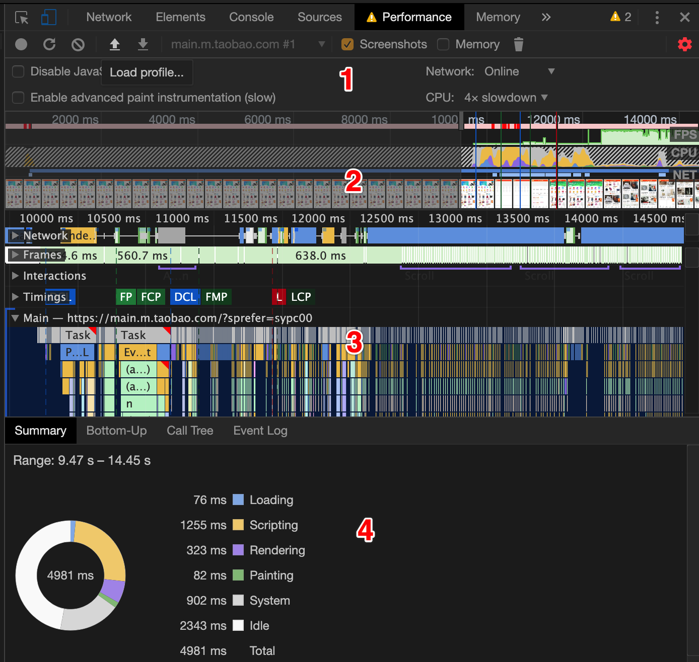
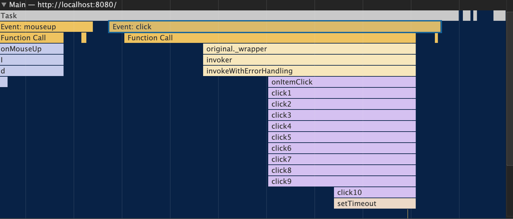
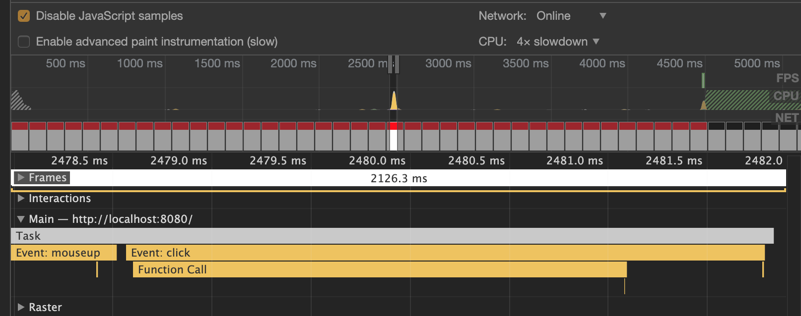
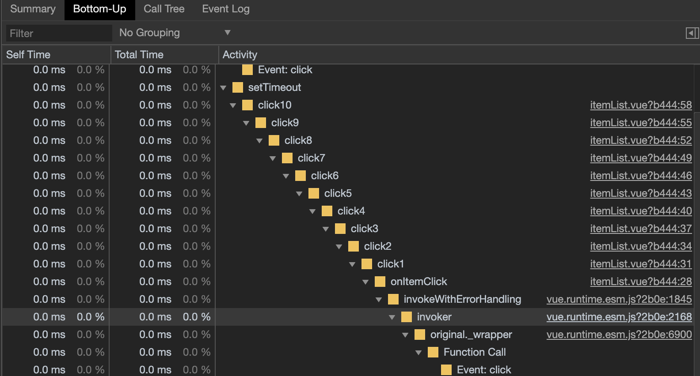
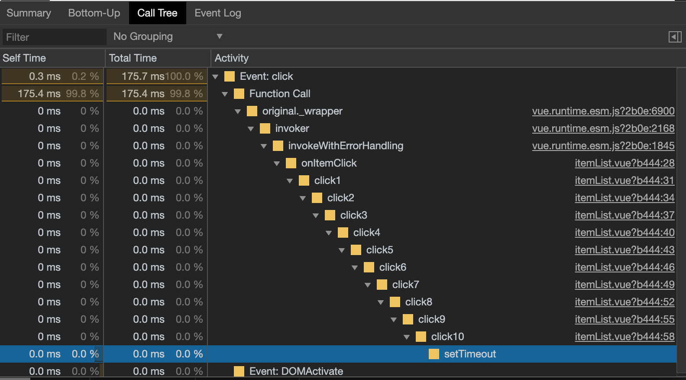
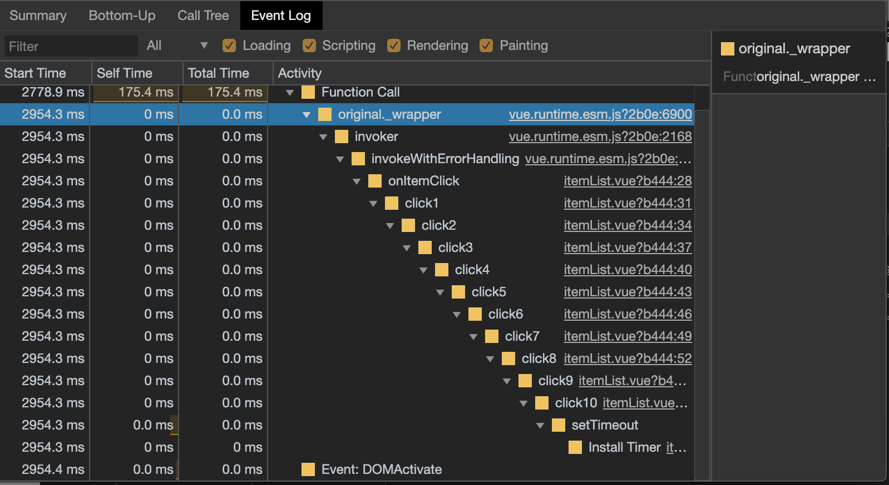

### 1. 介绍

   > 运行时性能分析工具，匿名模式下使用最佳，可以保证当前环境不受到影响，比如插件的影响；

### 2. 组成

  

  - Controls(控制面板)。开始记录，停止记录和配置记录期间捕获的信息。
  
  	* Disable JavaScript samples 默认情况下，记录中Main部分会详细显示整个录制过程中JavaScript函数调用栈情况，作用：禁用JavaScript示例可以减少在移动设备上运行时的开销。
  		
  		

  	* Network 设置网络加载速度

  	* CPU 将CPU设置为需要的运算速度模式，例如，4x slowdown 选项会使你本地CPU运算速率比正常情况下下降4倍

  	* Enable advanced paint instrumentation 加速渲染工具  记录渲染事件的细节

  	*  Memory 内存消耗记录：勾选后可以看到各种内存消耗曲线

  - Overview(概览面板)。 页面性能的高级汇总。

     	* FPS 每秒帧数。绿色竖线越高，FPS 越高。 FPS 图表上的红色块表示长时间帧，很可能会出现卡顿。

     	* CPU 处理各个任务花费的时间，选择一段CPU统计可以在区域四的Summary看到统计表格

     	* NET 各个请求花费时间，每条彩色横杠表示一种资源。横杠越长，检索资源所需的时间越长，每个横杠的浅色部分表示等待时间。

  - Flame graph(火焰图)。 您可以在火焰图上看到一到三条垂直的虚线、蓝线代表DOMContentLoaded 事件、绿线代表首次绘制的时间、红线代表 load 事件。
    * Frames 帧线程，鼠标悬浮绿色块可以看到fps

    * Main 主线程，负责执行Javascript, 解析HTML/CSS, 完成绘制，可以看到主线程调用栈和耗时情况，每个长条都是一个事件，悬浮可以看到耗时和事件名，x轴指时间，y轴指调用栈

    * Raster：Raster线程，负责完成某个layer或者某些块的绘制。

    * Interactions：查看并分析记录过程中用户的交互操作
    ```
    单个交互操作若是标有红色下划线，代表当前主线程处于等待状态。
    点击单个交互操作，在Summary 区域查看更多相关信息
    ```
    
  * FPS 每秒传输帧数, 标准是保持在60FPS, 绿色越高越好，出现红色则表示FPS低，则会出现卡顿
    
  * Network面板，记录过程中发生的网络请求会以瀑布流的方式展现。
  - 统计面板
    * Summary 统计图：展示各个事件阶段耗费的时间

      >	  蓝色：加载（Loading）事件
      >	
      >	  黄色：脚本运算（Scripting）事件
      >	
      >	  紫色：渲染（Rendering）事件
      >	
      >	  绿色：绘制（Painting）事件
      >	
      >	  灰色：其他（Other）
      >	
      >	  闲置：浏览器空闲

    * Bottom-Up 排序：可以看到各个事件消耗时间排序，分析哪些活动占用时间更多

    	- self-time 指除去子事件这个事件本身消耗的时间

    	- total-time 这个事件从开始到结束消耗的时间（包含子事件）

    	
    	
    *  Call Tree 调用栈：Main选择一个事件，可以看到整个事件的调用栈, 从最顶层到最底层，而不是只有当前事件
    	
    	* Event Log事件日志 按顺序分析记录中发生的活动
    	* 多了个start time，指事件在多少毫秒开始触发的

    	
      
    	

### 3. 如何看出问题(红色小三角)

  * Handler took xxx ms 操作消耗太多时间
  * forced reflow is likely performance bottleneck “强制同步布局”可能会导致性能问题，通常是因为修改样式后读取属性，导致了浏览器必须重新渲染以获取最新的属性值。
  * “布局抖动”是指反复出现强制同步布局情况。 这种情况会在 JavaScript 从 DOM 反复地写入和读取时出现，将会强制浏览器反复重新计算布局。 要确定布局抖动，请找到多个强制同步布局警告的模式。[布局抖动](https://developers.google.com/web/fundamentals/performance/rendering/avoid-large-complex-layouts-and-layout-thrashing)

  ```javascript
  function resizeAllParagraphsToMatchBlockWidth() {
      // Puts the browser into a read-write-read-write cycle.
      for (var i = 0; i < paragraphs.length; i++) {
        paragraphs[i].style.width = box.offsetWidth + 'px';
      }
  }
  ```

### 4. Rendering  tab

  - Paint Flashing 高亮显示网页中需要被重绘的部分。
  - Layout Shift Regions 
  - Layer Borders 显示Layer边界。
  - FPS Meter 每一秒的帧细节，帧速率的分布信息和GPU的内存使用情况。
  - Scrolling Performance Issues 分析鼠标滚动时的性能问题，会显示使屏幕滚动变慢的区域。
  - Emulate CSS Media 仿真CSS媒体类型，查看不同的设备上CSS样式效果，可能的媒体类型选项有print、screen

### References

[1] [https://developers.google.com/web/tools/chrome-devtools/evaluate-performance](https://developers.google.com/web/tools/chrome-devtools/evaluate-performance)

[2] [https://developers.google.com/web/tools/chrome-devtools/evaluate-performance/reference](https://developers.google.com/web/tools/chrome-devtools/evaluate-performance/reference)

[3] [https://developers.google.com/web/tools/chrome-devtools/evaluate-performance/performance-reference](https://developers.google.com/web/tools/chrome-devtools/evaluate-performance/performance-reference)

### Others

[1] 全新Chrome Devtool Performance使用指南 -  [https://zhuanlan.zhihu.com/p/29879682](https://zhuanlan.zhihu.com/p/29879682), 2017.

[2] 为什么帧率达到60fps页面就流畅？- [https://www.jianshu.com/p/90319dbf6fe7](https://www.jianshu.com/p/90319dbf6fe7), 2018.

[3] 页面渲染：性能分析 - [https://www.codercto.com/a/23704.html](https://www.codercto.com/a/23704.html), 2019.

[4] Lighthouse -  [https://developers.google.com/web/tools/lighthouse/](https://developers.google.com/web/tools/lighthouse/), 2022.
