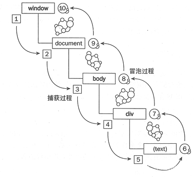

> ```事件传递``` 分为两个阶段，一是 ```事件捕获``` ，二是 ```事件冒泡``` 。分别对应下图1~5和6-10，每次触发的事件从window开始向下传播，一直到叶子节点，再往回传播。每个节点都允许添加监听器，浏览器在事件传播过程中一旦遇到监听器，就会去处理监听器里的脚本。当监听器的事情处理完后，监听器会执行默认行为，也就是滚动页面或者缩放页面等，当然，若该事件的cancelable属性为true，表明这个事件的默认行为可以阻止，我们也可以通过```e.preventDefault()```方法阻止默认行为的执行。

   

但不是所有的浏览器都是这样处理的，

  * Netscape认为事件流应该是事件捕获
  * ie认为事件流应该是事件冒泡， ie没有提供选择，事件只能在冒泡阶段捕获。ie认为事件流应该是事件冒泡
  * w3c认为首先是事件捕获然后是事件冒泡。在支持w3c的浏览器中，程序员可以通过设置 ```addEventListener(type, handler, useCapture)``` 中的userCapture值来决定元素是在冒泡阶段执行事件还是捕获阶段执行，默认为false，即冒泡阶段。

  若想阻止事件在1->10的传播，可在其中的监听器中加上```e.stopPropagation()```来阻断事件的传播。

  ```javascript
  document.getElementsByTagName('div')[0].addEventListener('click', (e) => {
      // 即可阻止上述图中事件在序号4继续传播
      e.stopPropagation();
  }, true)
  ```

### 拓展

  上文提到，我们可以在监听器中通过```e.preventDefault()```方法阻止默认行为的执行，但是对于并不需要阻止默认行为的事件，浏览器也只能等待监听器里的脚本执行完毕，才知道需不需要阻止此次默认行为，因为浏览器无法预先知道一个监听器会不会调用 preventDefault()，它能做的只有等监听器执行完后，看看这个监听器最后有没有```e.preventDefault()```。而监听器执行是要耗时的，有些甚至耗时很明显，这样就会导致页面卡顿，即便监听器是个空函数，也会产生一定的卡顿，毕竟空函数的执行也会耗时。
  所以，passive 监听器诞生了。

  > 2017年底，DOM 规范做了修订：addEventListener() 的第三个参数支持传递对象值：

  ```javascript
  addEventListener(type, listener, {
      capture: false,
      passive: false,
      once: false,
  })
  ```

  此时，当事件触发，浏览器就可以在监听器执行前就知道你想不想阻止默认行为，一旦监听器传递了 passive 参数，浏览器就会在另一个线程去执行浏览器的默认行为。

  > tips: 不要在传递了passive的监听器中再去做e.preventDefault()这种矛盾的写法，passive是告诉浏览器，我这个监听器里面没有e.preventDefault()，你不用等我了，去执行默认行为吧！而e.preventDefault()是告诉浏览器你想阻止浏览器的默认行为。

  如果你不小心这样写了，那么e.preventDefault()将被忽略

  ```javascript
  let event = new Event("foo", { // 创建一个可以被阻止默认行为的事件对象
      cancelable: true
  })

  document.addEventListener("foo", function(event) {
      console.log(event.defaultPrevented)
      event.preventDefault()
      console.log(event.defaultPrevented)
  }, {
      passive: true
  })
   
  document.dispatchEvent(event)
  ```

  同时，浏览器还会给你抛一个错误，```VM102:7 Unable to preventDefault inside passive event listener invocation.```
