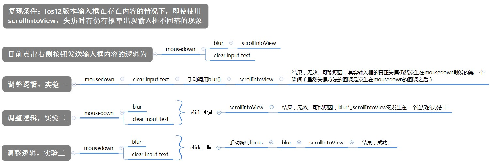

### 1. IOS

* 一旦某元素绑定了click或mousedown或touchmove等事件，在触发这些事件时会自动使输入框失焦，而当未绑定事件时，点击输入框外部的内容，输入框不会失焦。

* ios8 内层fixed定位失效，表现为与absolute效果相同
  > 解决办法：fixed定位元素放置最外层
  > 
  > 但是当页面滚动触底反弹时，fixed定位在ios上又会出现固定不动的情况
  > 
  > 解决办法：放置到外层，定位变更为absolute

* 输入框无法呼出虚拟键盘，
  > 问题原因：加了样式-webkit-user-select: none;
  > 
  > 解决方案：改成webkit-user-select: text;

* 输入框自动聚焦问题，手动点击按钮，显示另一个组件输入框主动聚焦
  > 问题原因：该组件为异步组件，无法实现（v-if和v-show也是无法实现的）。
  > 
  > 解决方案：$(‘input’).focus().triggerHandler(‘click’)   组件显示和隐藏使用zindex和透明度，
  > 
  > 若使用v-if，则上述的聚焦方法需要包裹在this.$nextTick(() => {})内部，此时ios系统仍然认为此次触发是非人为。

* iphone 8 plus和iphone 6页面滚动时上下抖动，iphone 8 plus的Tab标题切换延迟overflow hidden异常(也是上述原因造成的，不过当拿掉overflow hidden后也能恢复正常)
  > 解决方案：@keyframe添加的动画再加上absolute定位造成了ios滚动出现抖动现象

* iphone X左右切换时，使用overflow: hidden样式来阻止页面上下滚动，此时若存在上下位移时（即不是非常水平的左右切换），松手后页面scrollTop会被置为0
  > 问题原因：overflow hidden的原因，上下位移过程中scroll变成了负的（ios即使页面没有滚动条，也是可以滚动的）
  > 
  > 解决办法：使用e.stopPropagetion()  if (e.cancelabel) e.preventDefault() 阻止页面滚动

* fixed布局top: 0; bottom: 0; left: 0; right: 0;的fixeddom，点击内部输入框调起软键盘后，页面出现滚动条，滚动内容为fixeddom
  > 解决办法：暂未解决

* tab页卡切换，第一个tab正常切换，第二个以及之后的tab都无法切换
  > 解决方案：在包裹几个tab的父容器上添加属性width: fit-content 来使其能被子元素正常撑开，这样当第一个tab被切换走后（即父元素的位置发生了变动），后面的tab的touchmove事件依然能直接触发在父元素上

* 浮层弹框位置计算错误
  > 问题原因：在ios上offsetTop是相对最近的relative定位的父层级上边距，若没显示的指定relative的元素，则会一直向外寻找至最外层，所以offsetTop在使用时，需要指定relative谁定位

* （version < IOS 12.2）正常文档流布局时，首次弹出软件盘，输入框很大概率不出现在视口中
  > 解决方案：在页面加载完毕后，循环做以下操作
  > ```javascript
  > setInterval(() => {
  > 	$('input')[0].scrollIntoView({
  > 		block: 'end',
  > 		behavior: 'auto'
  > 	});
  > })
  > ```

* 发送消息后，输入框悬在半空不回落（点击事件使用了mousedown，发生在失焦事件之前）
  > 


* （IOS11.1、11.2）输入框聚焦时，软键盘遮挡住了输入框
  > 解决方案：在聚焦时，不要使用scrollTop和scrollIntoView。
  >
  > [相关文章](https://segmentfault.com/q/1010000012033973)

* 输入框使用原生软键盘输入拼音，不选择中文，然后使输入框失焦，在输入框内出现双倍的拼音内容
  > 解决方案：在聚焦时使用了this.select()或者input.selectionStart = input.value.length都会出现输入法的拼音重复添加的现象，去除使用上述方法

### Android

* 轮播布局父flex，子flex-shrink
  > 问题原因：安卓4.4.4不支持flex-shrink（ps：也不支持inline-flex）
  > 
  > 解决方案：父：white-space: nowrap;，子：display: inline-block;

* 低版本安卓原生浏览器touch事件中touchmove执行一次问题
  > 解决方案：e.preventDefault() 阻止页面默认行为


* 移动端软键盘回车文案改成搜索或前往字样
  > 网上解决办法：vue报错？（是因为这是原生js的写法，而且type=”search”不是必须的）
  > ```javascript
  > <form action="" onsubmit="javascript: return false">
  > 	<input type="search">
  > </form>
  > ```
  > 
  > 这种写法Android10和网页回车都会触发默认submit刷新页面
  > ```javascript
  > <form action="">
  > 	<input>
  > </form>
  > ```
  > 
  > vue的写法
  > ```javascript
  > <form action="" @submit.prevent="() => false">
  > 	<input>
  > </form>
  > ```

### Common

* 在使用display:inline-block时无论如何都无法把两个水平的元素对齐
  > 解决办法：在使用内联块元素布局时需要结合vertical-align: top;不然无法水平对齐

* v-if条件展示的dom节点包含图片链接，当条件改变为true时，加载图片存在一定时间，会出现一段时间的空白期
  > 解决方案：使用v-show

* 异步组件css过渡样式transition：bottom .3s，初次改变dom的bottom，无动画特效（延迟20ms改变bottom有平移动画，除异步组件首次加载之外同样有平移动画，应该是首次改变dom的bottom值，异步组件还未加载完毕）
  > 解决方案：使用vue的css过渡动画

* 在单位变成rem时，获取节点宽高时出现精度丢失问题，在经过多个数据后，误差放大发现问题
  > 解决方案：在获取节点宽高时，使用getBoundingClientRect().width，可获取小数点后3位

* rem布局background 图片大小可能出现偏差，
  > 解决方案：如果是精灵图的话，图片周围预留1px，若是单张图片，background-size尽量使用100% 100% 而不是cover

* mousedown在移动端和pc端的不同表现
  > 移动端：手指触摸抬起后触发（表现与click一致）
  >
  > pc端：鼠标按下时触发

* video视频播放问题
  > video需视频编码协议为h.264， h.265智能播放音频
  >
  > Safari video需视频接口允许携带range请求头，否则请求会报错range:'bytes=0-1'
  >
  > Safari video需视频接口返回明确格式的文件流，即下载文件后，文件带有后缀名
  >
  > video中使用source标签引入src无法动态更新src的视频内容，需要将src属性添加至video中
  >
  > [相关文章](https://blog.csdn.net/qq_41787619/article/details/81182574)

* 元素从无到有显示时，无法触发过渡动画
  > 原因：display: none状态的切换影响了其他过渡效果的切换，毕竟为none的元素没法触发过渡。
  >
  > 解决方案：将offsetWidth打开，就会发现过渡生效了，原因在于取offsetWidth导致浏览器出现重绘，使后面的style修改前，display确确实实变为了block，从而消除了元素状态为none对过渡的这种影响。添加setTimeout(() => {}, 20)，“打断”js的执行也可生效。


* last-of-type不生效问题
  > 问题原因：使用last-of-type的元素节点之后不可有兄弟节点

* 长图片和宽图片同时自适应父容器
  > ```javascript
  > max-height: 100%;
  > max-height: 100%;
  > ```

* 文字多行溢出省略号
  > ```javascript
  > overflow: hidden;
  > display: -webkit-box;
  > moz-line-clamp: 5;
  > ms-line-clamp: 5;
  > -webkit-line-clamp: 5;
  > -webkit-box-orient: vertical;
  > -ms-box-orient: vertical;
  > -moz-box-orient: vertical;
  > ```
